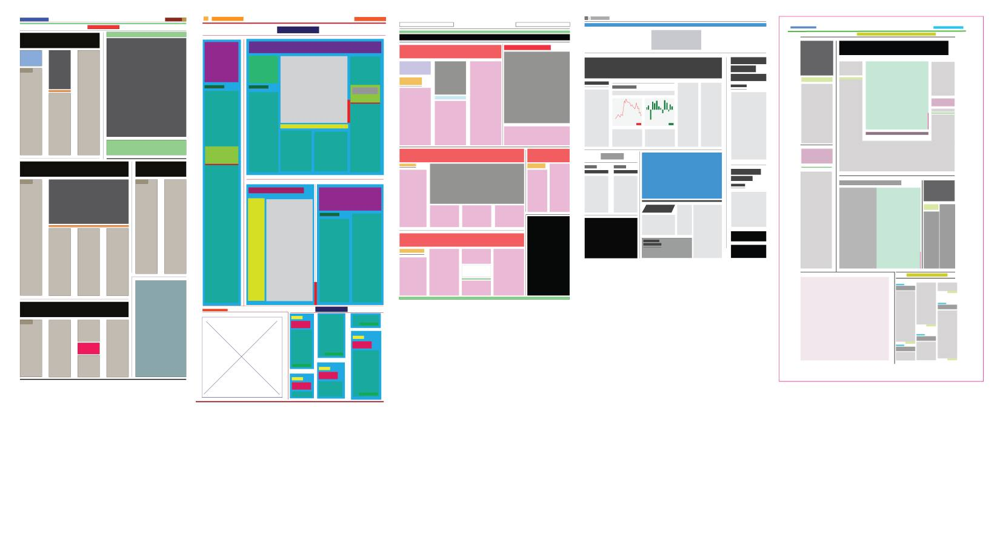

# Structure Analysis

1. As a small group, choose a website that you think has good content structure/hierarchy.
1. Identify different structural/hierarchical elements. You have to do this for every single thing on the main page.
1. Give each element a proper name, not by its appearance but by its structural role --- for example, heading, date, author, image caption, body text, section title, etc.
1. Identify any repeating elements and modules, for example, an *article* may be made up of *heading, date, time, author, body text and images.* When you think about a structure, you have to think not only about the article's own hierarchy but also the hierarchy of the whole page. 
1. Once you have figured out the structure, analyze the design decisions such as typeface, size, color, alignment, horizontal rule, image placement, etc. for each structural element.
1. When you look at how they are visually presented, is any of the visual elements confusing or clear enough to understand?
1. Next, open up Illustrator or InDesign and recreate its layout structure.
1. Replace the contents with simple geometric shapes. Do not write any text or use any images, express the structure only using simple geometric shapes with different colors for each element. For example, header with thick black line, body text with thin grey line, image with green rectangular box, etc. 

## Inspirations
- [Towards a Theory of Color Reading](http://www.stephaniesyjuco.com/projects/towards-a-new-theory-of-color-reading-el-dia-houston-forward-times-manila-headline)
- [Abstract Browsing](http://www.abstractbrowsing.net)
- [Wireframe](https://duckduckgo.com/?q=wireframe&bext=msl&atb=v97-3&iax=images&ia=images)

