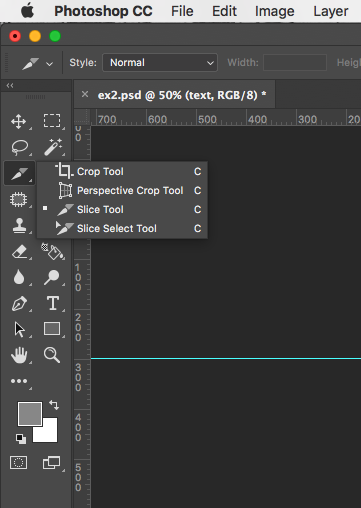
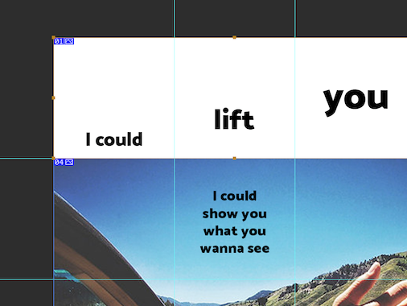
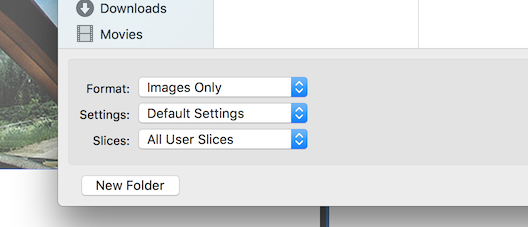

# Slicing PSD Mockup
You have your full design in Photoshop file. As a first step in converting PSD into HTML/CSS, we will look at how to slice the images according to the column grids.

*Note that this is not a typical way of preparing your images or your layout for most websites. We do this to start thinking about the grid system and hierarchy of webpage elements. It also helps you think in terms of modules, which is a crucial concept to understand in web design. With that said, again, this is not the only way to treat images.*

## Cleaning up your PSD
A few things to check...
- Are all text layers in the text folder in PSD so that they can easily be turned on or off?
- Are all images fit in the column grids? No pixels sticking out of the boxes?
- Did you accidently move the guides that are set every 300px? If so, it won'w work with the HTML/CSS template. 
- Is your PSD canvas size set to the multiple of 300 pixels? (300pixel is the column width and height) Hit COMMAND+OPTION+C to check it out.
- Did you name all your image layers properly so that it's easy to find what you need? 

We will use [this file](../files/p1-template-ex2.psd)(right-click and open in new tab) as an example.

## Create slices
You will mainly use Slice Tool and Slice Select Tool.

Now, draw rectangular selection using the Slice Tool for each slice you want to create. These will later be exported to individual images and can be set as background images of HTML elements.

As the image above shows, each slice gets numbered. Don't worry about the numbers, though. We will give custom names to the slices. Once you have created all the slices - make sure the slices are the same size as the column grids, choose the Slice Select tool and double-click on each slice to give customized names.

When you name the image slices, choose something descriptive. I prefer using the class names such as `img-spring`, `img-car`, etc. I will create these classes later in CSS. One less thing to remember that way.

Next, turn off all the text layers.

Go to *File > Export > Save for Web*. Use PNG as file format, and then Save.

From the save dialog, choose All User Slices.

Now, you have all the slices as individual image files!

